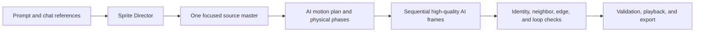

<p align="center">
  
</p>

<p align="center">
  A local-first AI workbench for creating, animating, testing, organizing, and exporting 2D game art.
</p>

<p align="center">
  <strong>macOS · Windows · Linux</strong>
</p>

<p align="center">
  
</p>

## From a prompt to a usable game asset

Generating one attractive image is easy. A production asset also needs a stable identity, clean transparency, readable scale, consistent palette, useful file structure, and—when it moves—a mechanically complete loop.

Sprite Studio keeps that work in one desktop workspace. Describe an asset in chat, attach or paste references, inspect the result at pixel scale, generate a high-frame-count AI animation with strict identity and neighbor references, test the loop, and export a sheet without losing the source files or the conversation that produced them.

The project is open source, local first, and built with Tauri, Svelte, Rust, SQLite, and an installed Codex CLI. It does not target Android or iOS.

## The workflow

1. **Generate in chat.** Use plain language or a slash command. Every chat keeps its own style, references, quality, dimensions, frame policy, FPS, model, and reasoning settings.
2. **Review the real output.** Static images open in the full-size sprite viewer. Related animation frames appear as one playable sprite set instead of flooding the library.
3. **Describe natural movement.** “Animate this” brings the source asset back to chat and asks how it should move, with suggestions based on visible anatomy.
4. **Plan once, generate sequentially.** AI plans the complete motion, then generates one frame at a time using the source identity and neighboring accepted frames. The default 24–48 frame range favors smooth motion; users can lower it at any time.
5. **Rig it with points when you want determinism.** The Rig editor places named joint points and capsule bones on any sprite — auto-placed from an anatomy template, suggested by the AI (`/rig` or “Ask AI”), or dragged by hand. The native Rust engine derives every bone's pixels from the capsules, solves planted contacts with two-bone IK, and renders byte-identical frames with no image generation at all.
6. **Test and export.** Scrub, retime, zoom, inspect warnings, test the loop in the playground, and export a PNG sheet plus metadata.

## Rigging in Rust

The rig engine is written natively in Rust and runs instantly on the local machine:

- **Points over masks.** A rig is a set of named points (`joint`, `anchor`, `contact`, `pivot`) and capsule bones between them. The engine auto-claims every opaque pixel inside the closest capsule and assigns leftovers to the nearest bone, so nobody hand-paints masks.
- **AI-suggested points.** `Ask AI` sends the sprite to your agent CLI and gets back a `rig-suggestion` JSON block of points, bones, and optional pose frames, with confidence values. `/rig` in chat does the same and the captured rig appears in the Rig tab automatically.
- **Deterministic rendering.** Per-frame bone rotations, scales, offsets, root motion, holds, and z-layering compose through parent chains and render with nearest-neighbor inverse mapping — identical inputs always produce identical PNG bytes.
- **Planted contacts.** Feet and hands stay pinned in place while the chain bends around them using analytic two-bone IK, so walk cycles do not slide.
- **Full pipeline.** Rendered frames land in `assets/<category>/`, become normal assets, form an animation with quality analysis, and flow into sheets, the playground, and exports like any other sprite.

## Motion that understands the subject

### Rabbit: a real hop cycle

The rabbit does not simply slide upward. Its eight-pose loop compresses the haunch, pushes from the hind leg, tucks in the air, reaches with the forefeet, absorbs contact, and recovers into the opening stance. The motion planner estimates a physical envelope unless the user supplies exact speed, height, or scale.

<p align="center">
  
</p>

### Dragon: one identity through a full wingbeat

This twelve-frame loop keeps the same dragon while the near and far wings move through a forceful downstroke, folded recovery, body lift, delayed legs, and tail counterbalance.

<p align="center">
  
</p>

### Centipede: connected segmented motion

Creature harnesses account for morphology that a human walk template cannot handle. The centipede uses a phase-shifted head-to-tail body wave, alternating leg banks, a stable ground line, and twelve distinct crawl frames at 12 FPS.

<p align="center">
  
</p>

Loop closure is part of planning, not an afterthought. The last pose advances naturally into the first without duplicating an endpoint or cutting the action short. Interpolation is enabled by default and can add deterministic in-between frames when the planned transition needs them.

## Generate a coordinated pack

`/pack` creates a collection of separate static assets that share one art direction. Use it for animals, environment objects, props, UI, effects, or another family of game art. Packs get their own library tab and can be used as a filter in the sprite browser.

<p align="center">
  
</p>

The pack manifest records its name, description, kind, style, creation time, and asset paths. The original PNG files remain normal project files—you are not locked into a proprietary export.

## Terrain stays one complete atlas

Terrain requests produce one large PNG atlas with compatible fills, edges, corners, strips, walls, slopes, and transitions. Sprite Studio shows the full result in the zoomable viewer and leaves slicing to the user, so generation never breaks one terrain concept into a confusing set of unrelated sprite cards.

<p align="center">
  
</p>

## What works today

- Project workspaces with **Character**, **Creature**, **Game Object**, **Environment**, **Tileset**, **UI**, and **VFX** worktrees
- A chat-only sidebar with expandable worktrees, per-worktree conversations, immediate worktree switching, rename dialogs, hover-to-archive actions, and visible background activity
- Concurrent generation across chats, so one job can keep running while the user works elsewhere
- Markdown-rendered assistant messages and playable animation cards inside chat, with **Edit animation** and **Export** actions
- Reference images from the file picker, clipboard paste, or drag-and-drop; each chat can focus, replace, remove, or clear its own source image
- Chat-local generation settings with Auto or Fixed frames, a 1–32 frame range, FPS, provider model, reasoning, deterministic frame adjustment, and interpolation enabled by default
- Provider capability discovery, so unavailable models, reasoning levels, multi-image input, structured output, or transparency are not falsely offered
- Dedicated harnesses for characters, creatures, game objects, animation, effects, terrain atlases, and asset packs
- Built-in art directions for cozy chibi, classic pixel art, limited palette, one-bit, isometric pixel, cel-shaded, and painterly fantasy work—with workspace and chat overrides
- Full-size sprite viewer with zoom controls, pixel-perfect scaling, wheel zoom, metadata, reveal-on-disk, and **Animate this**
- Grouped animation sets with frame-count badges, playable previews, a timeline editor, onion skinning, per-frame timing, templates, and non-destructive revisions
- Rig-only, AI-polish, and experimental full-redraw finishing modes
- Physical motion planning using estimated or user-supplied meters, meters per second, jump height, contact states, support phases, and world displacement
- Reusable motion templates and body-part masks with explicit pivots, overlap, z-order, stable regions, and loop closure
- Complete terrain atlases kept as one source image, plus generated asset packs with a dedicated Packs tab and sprite-library filtering
- Horizontal, vertical, and grid sheet export with padding, spacing, scale, pivots, and JSON metadata
- A lightweight playground for checking movement, scale, bounds, pivots, and playback speed
- Procedural and ImageGen-assisted VFX workflows
- Cancellable background jobs and per-chat loading indicators
- Content-hashed asset versions and non-destructive repair output
- Deterministic checks for dimensions, alpha boundaries, duplicates, continuity, alignment, scale, palette, motion plausibility, and seamless loops

Quality scores are diagnostics, not artistic judgments. Playback remains the final review.

## Generation profiles

Profiles are useful defaults, not hard limits. Every chat can switch to **Custom**.

| Profile | Canvas | Frames | FPS | Good for |
| --- | ---: | ---: | ---: | --- |
| Low | 32×32 | Auto, 4–32 | 6 | Tiny props, rough ideas, and quick loops |
| Mid | 64×64 | Auto, 4–32 | 8 | Most pixel-art characters and game objects |
| High | 128×128 | Auto, 4–32 | 12 | Detailed characters and smoother motion |
| Custom | 8–512 px | 1–32 | 1–60 | Project-specific pipelines |

Automatic frame selection is the default. The AI recommends the smallest mechanically complete loop within the chosen range. Choose **Fixed** only when a production pipeline requires an exact count. The help button in the settings dialog explains every control.

## Slash commands

| Command | Purpose |
| --- | --- |
| `/animate` | Build a seamless animation from the current chat context and motion settings |
| `/sprite` | Generate one polished static sprite |
| `/character` | Route the request through the ImageGen character harness |
| `/effect` | Create an animated game effect |
| `/pack` | Generate a coordinated collection of separate game assets |

A plain-language prompt still works. The router infers the correct harness and applies the chat’s saved style.

## How consistency works



Animation frames are generated individually in playback order, never as a pose sheet. Every call uses the exact identity reference and temporal neighbors; raw results are normalized back to the requested canvas, transparency, crisp palette, safe edge padding, and intended pose before entering the asset library.

## Desktop workbench

The left sidebar is reserved for worktrees and conversations. Creative tools stay open in persistent top-level tabs, so inspecting an asset never destroys chat context.

| Tab | Shortcut | Use |
| --- | --- | --- |
| Chat | `Cmd/Ctrl+1` | Prompt, attach references, review progress, and play output inline |
| Sprites | `Cmd/Ctrl+2` | Browse grouped assets, filter by category or pack, and open the sprite viewer |
| References | `Cmd/Ctrl+3` | Manage chat-scoped source and style references |
| Animate | `Cmd/Ctrl+4` | Play, scrub, retime, inspect, and repair loops |
| Rig | `Cmd/Ctrl+5` | Place points and bones, review AI suggestions, keyframe poses, and render deterministically |
| Sheets | `Cmd/Ctrl+6` | Build sprite sheets and metadata |
| Packs | `Cmd/Ctrl+7` | Review coordinated asset collections |
| Playground | `Cmd/Ctrl+8` | Test gameplay scale, movement, and animation |

VFX worktrees add their effect tools without removing the rest of the workbench.

## Build from source

### Requirements

- [Bun](https://bun.sh/)
- Stable [Rust](https://www.rust-lang.org/tools/install)
- The native prerequisites required by Tauri 2 for your desktop operating system
- An installed Codex CLI for live agent conversations and access to its reported models

### Run in development

```bash
bun install
bun run check
bun tauri dev
```

### Verify the native core

```bash
cargo test --manifest-path src-tauri/Cargo.toml
cargo clippy --manifest-path src-tauri/Cargo.toml --all-targets -- -D warnings
```

### Build a desktop bundle

```bash
make release
```

`make release` runs the frontend and Rust tests, builds Tauri locally, and collects the installable files in `release-artifacts/<version>/<platform>`.

Tagged GitHub releases build Linux and Windows automatically. macOS stays local because hosted macOS runners are substantially more expensive:

| Platform | Build path | Release files |
| --- | --- | --- |
| macOS | `make release-macos` on a Mac | Universal Intel + Apple Silicon `.dmg` and `.app.tar.gz` |
| Windows | GitHub release workflow | NSIS `.exe` and `.msi` installers |
| Linux | GitHub release workflow | `.AppImage`, `.deb`, and `.rpm` packages |

After the tag workflow creates the GitHub release, run `make publish-macos` to build the universal macOS bundle locally and attach it to the matching `v<version>` release. Set a different tag with `make publish-macos TAG=v0.3.1` when needed.

Use `make help` to see the available local commands. Tauri creates platform-native installers on the relevant build host; this repository contains no Android or iOS targets.

## Workspace layout

Binary artifacts remain ordinary files below the selected project root, so a workspace can be backed up, inspected, versioned, or used by a game engine without a hosted Sprite Studio service.

```text
assets/
  characters/
  creatures/
  terrain/
  props/
  effects/
  references/
  repairs/
  vfx/
animations/
exports/
  sprite-sheets/
.sprite-studio/
  imagegen-sources/
  masters/
  packs/
  ai-frame-sources/
  reports/
  sprite_tool.py
  sprite_polish.py
  terrain_cleanup.py
```

SQLite stores project metadata, conversations, worktrees, asset versions, timelines, references, templates, jobs, and quality reports. Images and exports remain in the workspace itself.

## Data safety

- Generated files are registered only after validation.
- Asset changes create content-hashed versions.
- Sheet exports, alignment repairs, and AI-polished frames create new files and records.
- Deleting a sheet never deletes its source frames.
- Quality warnings can be acknowledged without changing artwork.
- A new chat starts without a forced master image; focused references belong to that chat and remain user-controlled.

## Project status

Sprite Studio `0.3.0` is an early public release. The core desktop workflow works, but file formats, provider adapters, and generation harnesses will continue to evolve.

## Contributing and governance

Contributions are welcome through reviewed pull requests. Read [CONTRIBUTING.md](CONTRIBUTING.md) for the development workflow and [GOVERNANCE.md](GOVERNANCE.md) for the distinction between contribution credit, maintainer access, code ownership, and project ownership.

## License

MIT
